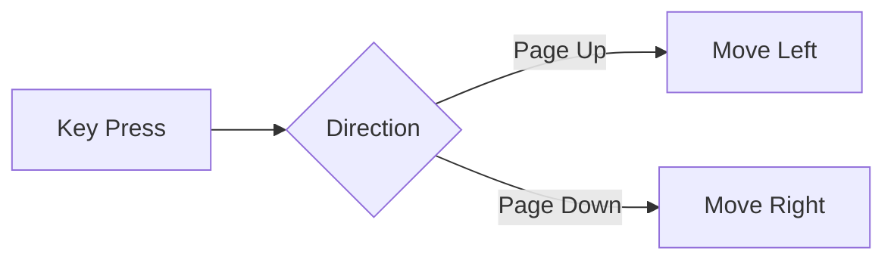

# IntelliJ Move Tab

Quickly reorder your editor tabs with simple keyboard shortcuts.

Plugin page: https://plugins.jetbrains.com/plugin/13087-movetab

### Usage
* **Ctrl+Shift+Page Up** – move the current tab to the left
* **Ctrl+Shift+Page Down** – move the current tab to the right

Based on the original plugin by [momomo.com](https://plugins.jetbrains.com/plugin/8443-a-move-tab-left-and-right-using-the-keyboard-plugin--by-momomo-com).

### Build

Run `./gradlew :move-tab-plugin:verifyPlugin` to build and test the plugin.
